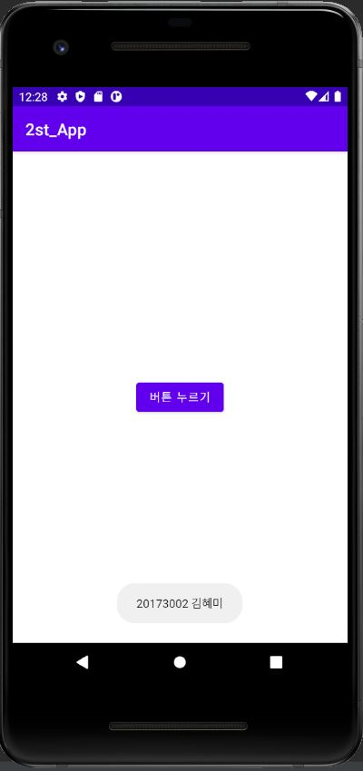
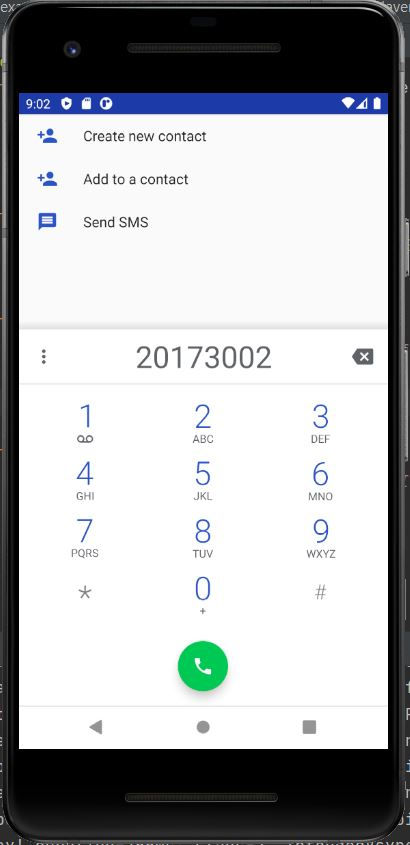

# 캡스톤디자인 주간 A반 20173002 김혜미

## 1주차 과제

## 2주차 과제
  - 출석과제
  
</img>

## 3주차 과제
- 네이버 화면

</img>
- 전화번호 입력창 화면

</img>

## 4주차 과제 (생각 중)
- mbti
  - mbti 검사 결과를 이용하여 성향에 맞는 사람들과의 소통이 가능한 앱 or mbti 궁합을 알려주는 앱
  - mbti를 모르는 사람들을 위한 검사 페이지로 넘어가는 버튼
  - mbti를 알고 있는 사람들을 위한 성향 클릭 버튼
  - 성향을 선택하면 성향이 맞는 mbti를 가진 사람 또는 같은 mbti를 가진 사람을 표시해줌.
  - 나에게 잘 맞는 성향과 맞지 않는 성향을 알려줌
  
- 공중화장실
  - 화장실이 급한데 열려있는 화장실이 어디있는지 모르는 사람들을 위한 앱
  - 지도를 통해 가까운 곳의 화장실 위치를 알려줌
  - 공공기관, 지하철이나 5층 이상의 건물(화장실 필수)이 있는 장소를 알려줌 

## 5주차 과제
