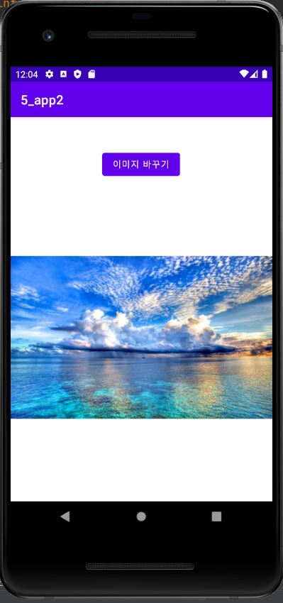
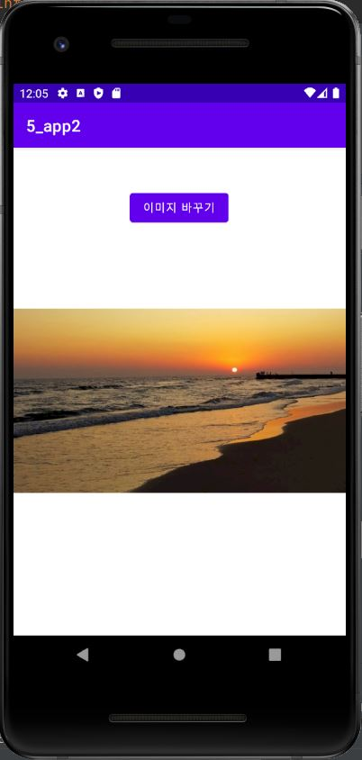
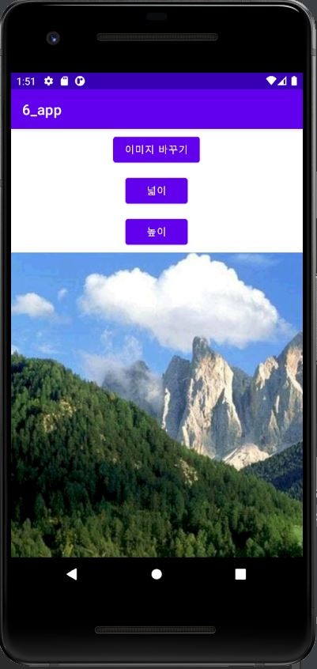
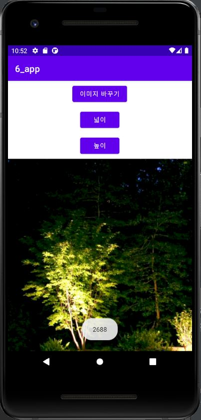
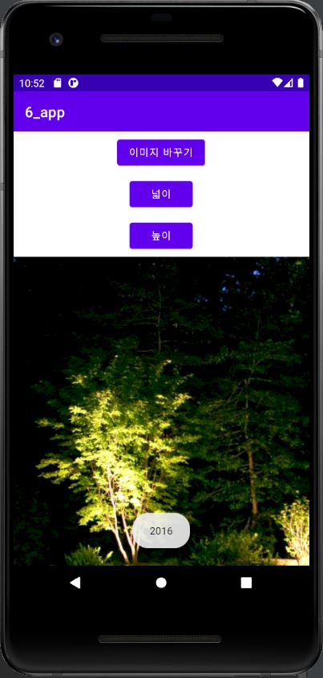
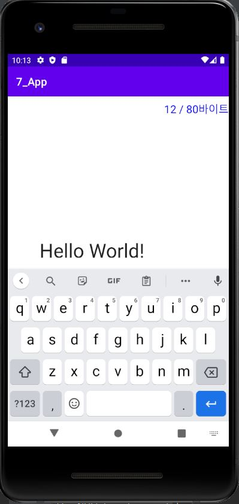
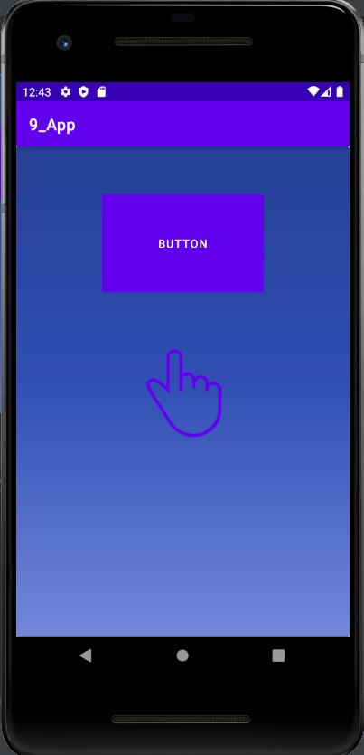
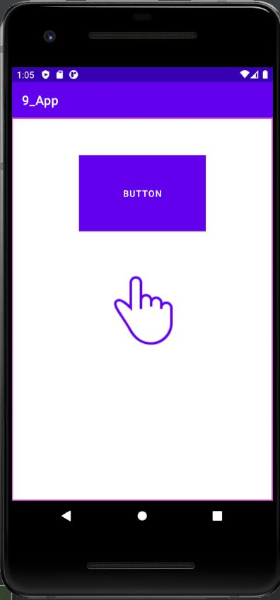

# 캡스톤디자인 주간 A반 20173002 김혜미

## 1주차 과제

## 2주차 과제
  - 출석과제
  
</img>

## 3주차 과제
- 네이버 화면

</img>
- 전화번호 입력창 화면

</img>

## 4주차 과제
- mbti
  - mbti 검사 결과를 이용하여 성향에 맞는 사람들과의 소통이 가능한 앱 or mbti 궁합을 알려주는 앱
  - mbti를 모르는 사람들을 위한 검사 페이지로 넘어가는 버튼
  - mbti를 알고 있는 사람들을 위한 성향 클릭 버튼
  - 성향을 선택하면 성향이 맞는 mbti를 가진 사람 또는 같은 mbti를 가진 사람을 표시해줌.
  - 나에게 잘 맞는 성향과 맞지 않는 성향을 알려줌

## 5주차 과제
- 첫 번째 이미지

</img>

- 두 번째 이미지

</img>

## 6주차 과제
- 첫 번째 이미지

</img>

- 두 번째 이미지

</img>

- 세 번째 이미지

</img>

## 7주차 과제
- 출석과제

</img>

## 9주차 과제
- 첫 번째 이미지

</img>

- 두 번째 이미지

</img>
